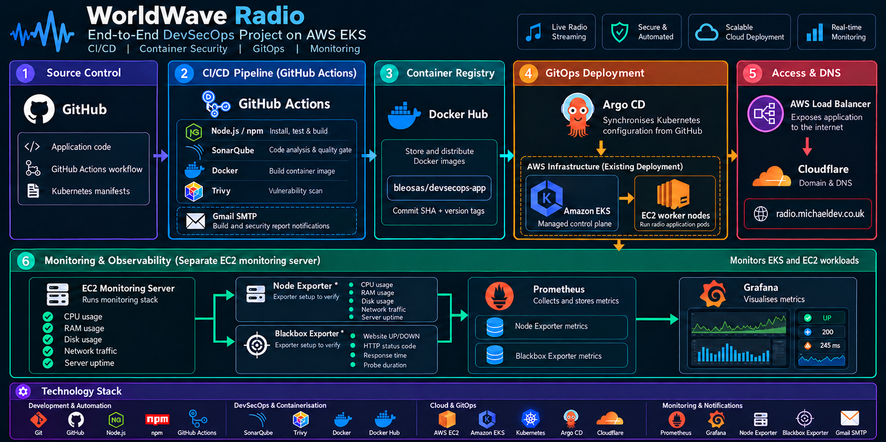

# 🌍 WorldWave Radio — End-to-End DevSecOps Project on AWS EKS

**Built by Michael | Cloud & DevOps Engineering Portfolio**

A global radio streaming application with automated delivery, container security scanning, GitOps deployment and application observability.

[](https://github.com/michael-git-repo/end-to-end-eks-clsuter-with-monitoring/actions/workflows/worldwave-radio.yml)


[📻 Radio website](http://radio.michaeldev.co.uk) · [Source repository](https://github.com/michael-git-repo/end-to-end-eks-clsuter-with-monitoring) · [Pipeline runs](https://github.com/michael-git-repo/end-to-end-eks-clsuter-with-monitoring/actions) · [Architecture](#architecture)

<a id="architecture"></a>
## 🏗️ Project Architecture

**Architecture image awaiting upload.** The supplied diagram will be stored at `images/architecture.png` and displayed here. No architecture image was available in the workspace during this documentation update.

<!-- Enable this reference after the original architecture image is supplied:

-->

**Delivery:** GitHub → GitHub Actions → dependency installation and tests → SonarQube → Docker build → Trivy → Docker Hub → Kubernetes manifest update → Argo CD → Amazon EKS.

**Application access:** domain managed through Cloudflare → AWS Load Balancer → Kubernetes Service → radio application. Cloudflare is the intended external DNS layer; its configuration is not stored in this repository.

**Observability:** application `/metrics` → external Prometheus → Grafana. Node Exporter and Blackbox Exporter are described below as extensions whose deployment cannot be verified from this repository.

> **Evidence boundary:** repository files confirm the delivery configuration and deployment intent. They do not prove that AWS resources are currently running. Existing EKS and external monitoring services are user-reported; unverified infrastructure is identified explicitly below. The architecture diagram will also need to be checked against this evidence when supplied.

## 📻 Project Overview

WorldWave Radio is a cloud-native internet radio application with a global station directory, interactive globe, station playback and visitor statistics. The project brings application delivery and operations together: GitHub Actions runs CI/CD, Docker packages the application, SonarQube evaluates code quality, Trivy scans container vulnerabilities, and Argo CD synchronises Kubernetes configuration into an existing Amazon EKS environment. Prometheus and Grafana provide the monitoring integration.

The project demonstrates a traceable path from a source change to a published container and a GitOps deployment. GitHub stores both application code and the desired Kubernetes state, while security reports are retained as pipeline artifacts and emailed as PDF attachments.

### What the project solves

Listeners often have to search separate websites to find stations from home or discover broadcasts in another country. WorldWave Radio brings available internet radio streams into one interface, with station discovery, an interactive globe and playback. It helps listeners stay connected to local voices, including stations from Benin City and Edo State, while exploring radio around the world. Playback depends on each broadcaster providing a working internet stream; the application does not receive terrestrial FM signals or guarantee every station is online.

The engineering project also addresses common delivery and operations problems:

| Problem | How this project addresses it |
| --- | --- |
| Manual, inconsistent releases | GitHub Actions repeats dependency installation, testing, analysis and image publication for each delivery run. |
| Differences between development and deployment environments | Docker packages the built application and runtime into a deployable image. |
| Code defects and vulnerabilities discovered late | Tests and SonarQube quality gates check changes before publication; Trivy makes image vulnerabilities visible in reports. |
| Deployment configuration drifting from source control | Argo CD reconciles the Kubernetes workload with the manifests stored in GitHub. |
| Limited visibility into application behaviour | Prometheus metrics and Grafana dashboards provide traffic, error, latency and process-health visibility when connected. |
| Security results scattered across tools | Pipeline artifacts and emailed PDF reports bring build-specific analysis results together for review. |

| Documentation | Purpose |
| --- | --- |
| [Application guide](worldwave-radio/README.md) | Radio features, application setup and operational details |
| [CI/CD workflow](.github/workflows/worldwave-radio.yml) | Authoritative pipeline steps and conditions |
| [Dockerfile](worldwave-radio/Dockerfile) | Build stages and runtime configuration |
| [Kubernetes manifests](k8s/) | Deployment, LoadBalancer Service and Argo CD Application |
| [Monitoring guide](worldwave-radio/monitoring/README.md) | External Prometheus access and Grafana setup |
| [Port reference](ports.md) | Existing tool and service port documentation |

## 🚀 CI/CD Pipeline

The workflow runs on pushes to `main` and can also be started manually through GitHub Actions.

| Step | Component | Role in the delivery workflow |
| --- | --- | --- |
| 1 | **GitHub** | Stores source code, workflow definitions and Kubernetes configuration. |
| 2 | **GitHub Actions** | Checks out the repository and orchestrates testing, analysis, image publication, manifest updates and reports. |
| 3 | **Node.js / npm** | Installs dependencies with `npm ci` and runs application tests with coverage. The application build runs inside the Docker build stage in step 5. |
| 4 | **SonarQube** | Imports coverage, performs static analysis and waits for the configured quality gate. |
| 5 | **Docker** | Builds the application and packages its runtime into an image tagged with the commit SHA and workflow run version. |
| 6 | **Trivy** | Scans the container image and produces a JSON vulnerability report. |
| 7 | **Docker Hub** | Publishes images to `bleosas/devsecops-app`. |
| 8 | **Argo CD** | Detects the image-tag change committed by the workflow to `k8s/deployment.yml` and synchronises the manifests. |
| 9 | **Amazon EKS** | Target Kubernetes platform for running the application workload in the existing cluster. |
| 10 | **AWS Load Balancer** | The Kubernetes `LoadBalancer` Service requests external access on port 80, forwarding to application port 8080. |
| 11 | **Cloudflare** | Intended domain and DNS management for `radio.michaeldev.co.uk`; configured externally, not by this workflow. |

**What controls promotion:** failed tests or a failed SonarQube quality gate stop the normal image publication path. Trivy currently uses `exit-code: 0`, so vulnerability findings are reported but do not themselves block publication. Report and notification steps use `always()` conditions to attempt delivery even after earlier failures.

**Runtime compatibility:** application dependencies and tests use Node.js 24. A separate Node.js 18.20.8 executable is supplied specifically to the SonarQube JavaScript analyser for compatibility with the existing server. This older analyser runtime should be revisited when the server is upgraded.

**Coverage:** the pipeline generates JavaScript LCOV and Python XML reports before analysis. Python reporting scripts have an explicit 82% coverage check. Quality-gate conditions themselves are managed on the SonarQube server.

## ☁️ AWS Infrastructure

This repository integrates with an **existing EKS cluster**. It contains application manifests and connection helpers, but no infrastructure definitions proving that the following AWS networking resources were provisioned by this project.

| AWS component | Purpose | Evidence and verification status |
| --- | --- | --- |
| **AWS EC2** | Can host cluster workers or supporting DevOps services. | EC2 is referenced in setup guidance; deployed instances and worker types are not verified. |
| **Amazon EKS** | Managed Kubernetes control plane for the application. | Existing-cluster connection helper and Kubernetes deployment configuration are present; live cluster state is not verified. |
| **Amazon VPC** | Network boundary for cluster and supporting resources. | No VPC configuration or resource IDs are included. |
| **Public subnets** | Can support internet-facing load balancers and public routing. | Subnet IDs, routes and actual placement are not verified. |
| **Private subnets** | Can isolate worker nodes and internal workloads. | No private subnet or node-placement configuration is included. |
| **Internet Gateway** | Provides internet routing for a VPC's public subnets. | No gateway or route-table association is defined here. |
| **NAT Gateway** | Can provide outbound internet access from private subnets. | No NAT Gateway configuration is included; its use is unverified. |
| **Security Groups** | Control permitted network traffic to AWS resources. | No security group rules or IDs are included. |
| **AWS Load Balancer** | Exposes the application through a Kubernetes Service. | `service.yml` declares `type: LoadBalancer`; the actual AWS load balancer, controller and load balancer type are not verified. |

The AWS CLI, `eksctl`, `kubectl` and Terraform installation scripts are tooling helpers. Their presence does not establish that infrastructure was created.

### Kubernetes and GitOps configuration

- [deployment.yml](k8s/deployment.yml) defines one application replica in `worldwave-radio`, using `bleosas/devsecops-app` and container port 8080.
- [service.yml](k8s/service.yml) exposes port 80 through a `LoadBalancer` Service targeting port 8080.
- [argocd.yml](k8s/argocd.yml) tracks `main`, synchronises the deployment and service, and enables automatic pruning, self-healing and namespace creation.
- The Argo CD destination is the cluster where Argo CD runs. That installation must be connected to the intended EKS environment.

**Current scope:** the deployment does not define a persistent volume, resource requests/limits, or readiness/liveness probes. Visitor data is therefore not configured to persist across pod replacement. The Service does not configure TLS termination or select a specific AWS load balancer type. These manifests are authoritative where older setup notes describe additional features.

## 📊 Monitoring and Observability

Prometheus and Grafana are reported as running on another machine. The repository supplies integration configuration for those external services rather than installing them inside EKS.

| Tool | Monitoring responsibility | Repository status |
| --- | --- | --- |
| **Prometheus** | Collects application request counts, request duration, HTTP status and process metrics. | Example scrape configuration and alert rules are supplied; live ingestion is not verified. |
| **Grafana** | Visualises application availability, traffic, errors, latency, process CPU, memory and uptime. | An importable dashboard is supplied; live dashboard state is not verified. |
| **Node Exporter** | Host CPU, RAM, disk, network and uptime monitoring. | No installation or scrape configuration was found. Treat as an unverified extension. |
| **Blackbox Exporter** | Website availability, HTTP status and response-time monitoring through external probes. | No probe or scrape configuration was found. Treat as an unverified extension. |

The application serves Prometheus metrics at `/metrics`. The supplied configuration accesses them through the Kubernetes API service proxy using a dedicated ServiceAccount, scoped RBAC, a token file and TLS CA verification. See the [monitoring setup guide](worldwave-radio/monitoring/README.md) for configuration and token renewal.

| Monitoring artifact | Contents |
| --- | --- |
| [Prometheus example](worldwave-radio/monitoring/prometheus.example.yml) | External scrape target and authentication placeholders |
| [Access configuration](worldwave-radio/monitoring/access.yml) | ServiceAccount, Role and RoleBinding for metrics access |
| [Grafana dashboard](worldwave-radio/monitoring/grafana-dashboard.json) | Eight panels covering reachability, traffic, errors, latency and process health |
| [Alert rules](worldwave-radio/monitoring/alerts.yml) | Missing/down target, elevated server errors and high process memory |

Application process metrics are distinct from host metrics. The current dashboard does not establish host disk/network usage, active listener counts or availability of every upstream radio stream. The memory alert uses a fixed threshold; the current Deployment does not configure a corresponding container memory limit.

## 🛡️ Security and Notifications

| Control | Implementation |
| --- | --- |
| **Code quality** | SonarQube static analysis, imported coverage and a blocking quality-gate check. |
| **Container vulnerability visibility** | Trivy scans the built image and exports findings across configured severity levels. Findings are currently informational to the pipeline. |
| **Runtime isolation** | Multi-stage Docker build with a minimal Chainguard Node runtime running as non-root UID/GID `65532`. The runtime currently uses a mutable `latest` base tag. |
| **Security reports** | Python scripts export SonarQube results and generate white-background PDF reports using ReportLab. |
| **Gmail SMTP notifications** | The workflow attempts to email available PDF/JSON security reports using authenticated Gmail SMTP over TLS on port 465. |
| **Artifact retention** | Coverage and security-report artifacts are configured for 30-day retention in GitHub Actions. |

Configure credentials in **GitHub Actions secrets**, never in source files or screenshots:

| Secret | Purpose |
| --- | --- |
| `SONAR_HOST_URL` | SonarQube server address |
| `SONAR_TOKEN` | SonarQube analysis and reporting authentication |
| `DOCKER_PASSWORD` | Docker Hub credential for the configured `bleosas` account |
| `GMAIL_USERNAME` | SMTP sender account |
| `GMAIL_APP_PASSWORD` | Gmail app password for report delivery |

A successful workflow does not mean an image has no vulnerabilities. Review the attached Trivy findings and SonarQube results for the particular build.

## 🧰 Technology Stack

| Category | Technologies | Project use |
| --- | --- | --- |
| Application | Node.js, JavaScript, npm, D3 Geo | Radio application, globe and application build |
| Source control and CI/CD | Git, GitHub, GitHub Actions | Versioning, automated validation and delivery |
| Quality and reporting | SonarQube, Node.js test runner, Python coverage, ReportLab | Analysis, coverage and PDF reports |
| Containers and registry | Docker, Chainguard, Docker Hub | Image packaging, non-root runtime and publication |
| Container security | Trivy | Image vulnerability reports |
| Orchestration and GitOps | Kubernetes, Amazon EKS, Argo CD | Declarative deployment and synchronisation |
| Cloud and networking | AWS CLI, EKS, LoadBalancer Service | Existing-cluster integration and requested external exposure |
| Observability | Prometheus, Grafana | Application metrics, dashboards and alert configuration |
| Observability extensions | Node Exporter, Blackbox Exporter | Host and synthetic website monitoring; unverified |
| Domain and notifications | Cloudflare, Gmail SMTP | Intended external DNS and configured pipeline emails |
| Administration | Linux, Bash, kubectl, eksctl | Tool installation, cluster access and operational scripts |

## 💻 How to Run the Project

### 1. Prepare your environment and clone the repository

Install Git and choose either Node.js 24 with npm for local development, or Docker for a container preview. Internet access is needed to download dependencies and listen to station streams. The commands below use Bash, available on Linux, macOS, WSL or Git Bash.

```bash
git clone https://github.com/michael-git-repo/end-to-end-eks-clsuter-with-monitoring.git
cd end-to-end-eks-clsuter-with-monitoring
```

If you already have a checkout, open its root directory instead of cloning again.

### 2. Run locally with Node.js

From the repository root, install dependencies, validate the source, run tests, build the browser assets and start the server:

```bash
cd worldwave-radio
npm ci
npm run check
npm test
npm run build
npm start
```

Open [http://localhost:8080](http://localhost:8080). Keep the terminal running and press **Ctrl+C** to stop the server. `PORT` defaults to `8080`; `DATA_DIR` defaults to the application's `data/` directory for visitor records. Run `npm run build` again after changing browser assets.

### 3. Alternatively, run with plain Docker

With Docker running, open a terminal at the repository root:

```bash
docker build --pull -t worldwave-radio:local ./worldwave-radio
docker volume create worldwave-radio-preview-data
docker run -d --name worldwave-radio-preview \
  -p 127.0.0.1:8081:8080 \
  -v worldwave-radio-preview-data:/app/data \
  worldwave-radio:local
```

Open [http://localhost:8081](http://localhost:8081). The named volume preserves local visitor data when the container is replaced. An existing data volume must be writable by runtime UID/GID `65532`; local Docker persistence does not add storage to the Kubernetes deployment.

Check the running container and its health endpoint:

```bash
docker ps --filter name=worldwave-radio-preview
docker logs worldwave-radio-preview
curl --fail http://localhost:8081/healthz
```

The health endpoint should return `ok`. Stop and restart the same preview with `docker stop worldwave-radio-preview` and `docker start worldwave-radio-preview`. To use a newly built image, stop and remove the old container with `docker rm worldwave-radio-preview`, then repeat the build and run commands; keep the named volume to retain visitor data.

### 4. Deploy through GitHub Actions and Argo CD to your existing EKS cluster

This path requires an existing EKS cluster, AWS CLI credentials with cluster access, `kubectl`, Argo CD installed in that cluster, a reachable SonarQube server and Docker Hub/Gmail credentials. It does not create a new EKS cluster or its networking.

1. Add the five GitHub Actions secrets listed in **Security and Notifications**. Confirm that the workflow can write repository contents to update the deployment image tag and that the configured Docker Hub account can publish to `bleosas/devsecops-app`.
2. From the repository root, replace the example values below and connect to the existing cluster:

   ```bash
   export AWS_REGION="your-aws-region"
   export EKS_CLUSTER_NAME="your-existing-cluster-name"
   bash worldwave-radio/scripts/connect-eks.sh
   export KUBE_CONTEXT="worldwave-$EKS_CLUSTER_NAME"
   kubectl --context "$KUBE_CONTEXT" get nodes
   ```

3. Register the application with the existing Argo CD installation:

   ```bash
   kubectl --context "$KUBE_CONTEXT" apply -f k8s/argocd.yml
   kubectl --context "$KUBE_CONTEXT" -n argocd get application worldwave-radio
   ```

4. Push a change to `main`, or open **GitHub → Actions → DevSecOps Pipeline → Run workflow**. After successful testing and analysis, the workflow publishes the image and commits its new tag to the deployment manifest. Argo CD then synchronises that revision. A fork must update the workflow's registry settings and the Argo CD repository URL before using this path.
5. After Argo CD has synchronised, check the rollout and external address:

   ```bash
   kubectl --context "$KUBE_CONTEXT" -n worldwave-radio rollout status deployment/worldwave-radio --timeout=300s
   kubectl --context "$KUBE_CONTEXT" -n worldwave-radio get pods
   kubectl --context "$KUBE_CONTEXT" -n worldwave-radio get service worldwave-radio
   ```

   Open the Service's external hostname over HTTP when AWS has provisioned it. If the address remains pending, inspect the Service events and the cluster's load balancer integration. To use `radio.michaeldev.co.uk`, configure its DNS record in Cloudflare to point to the provisioned load balancer hostname; domain setup is separate from the pipeline.

6. Connect the external Prometheus instance and import the Grafana dashboard using the [monitoring guide](worldwave-radio/monitoring/README.md). Verify target health and actual dashboard data before treating monitoring as operational.

### Quick troubleshooting

| Symptom | Check |
| --- | --- |
| Local page does not load | Confirm `npm run build` completed and the server is running on the expected port. |
| Docker reports the container name is already in use | Start the existing preview, or stop/remove that container before creating its replacement. |
| A station does not play | Try another station; upstream streams can be offline or restricted by the broadcaster or browser. |
| Pipeline stops at SonarQube | Review the analysis logs, server connectivity, coverage imports and failed quality-gate conditions. |
| Deployment does not update | Check the workflow's manifest commit, Argo CD sync status and the pod's image-pull events. |

## 🖼️ Portfolio Screenshots

Genuine screenshots will be added when supplied. No dashboard images or successful scan results have been fabricated. Capture readable views with credentials and other sensitive information removed.

| Screenshot | Suggested file | Evidence to show |
| --- | --- | --- |
| Architecture | `images/architecture.png` | Actual system components and their connections |
| GitHub Actions | `images/github-actions.png` | Pipeline stages and a run tied to a commit |
| SonarQube | `images/sonarqube.png` | Project quality gate, coverage and analysis date |
| Trivy report | `images/trivy-report.png` | Image tag, scan date and vulnerability summary |
| Argo CD | `images/argocd.png` | Application sync/health status and deployed revision |
| Grafana | `images/grafana.png` | Dashboard panels with a visible time range and metrics |

**Status:** architecture and screenshot assets are awaiting upload. The files above are proposed destinations, not existing evidence.

## 🎯 Skills Demonstrated

- **CI/CD automation:** GitHub Actions workflow orchestration, dependency installation, testing, coverage and artifact handling.
- **AWS integration:** connecting tooling and application delivery to an existing EKS environment and understanding cloud networking requirements.
- **Kubernetes:** declarative Deployments, Services, namespaces and scoped monitoring access.
- **Container engineering and security:** multi-stage builds, non-root execution, image tagging and vulnerability reporting.
- **GitOps:** version-controlled desired state, Argo CD synchronisation, pruning and self-healing.
- **Linux administration:** shell-based tool installation, service setup and operational troubleshooting.
- **Observability:** Prometheus metrics, alert definitions, Grafana dashboards and external monitoring integration.

## 🔧 Supporting Linux Setup Scripts

The original DevOps script collection remains available under [scripts/](scripts/), including installers for AWS CLI, Docker, eksctl, kubectl, SonarQube, Trivy, Grafana and Terraform, alongside Argo CD and Ubuntu maintenance helpers.

For a selected script on Ubuntu/Linux:

```bash
chmod +x scripts/script-name.sh
./scripts/script-name.sh
```

Review the selected script before execution, use appropriate privileges, and verify the installed tool version or service status afterwards. These helpers are separate from the GitHub Actions delivery workflow.

## 🔗 Project Links

- **Repository:** [WorldWave Radio source and configuration](https://github.com/michael-git-repo/end-to-end-eks-clsuter-with-monitoring)
- **Radio website:** [http://radio.michaeldev.co.uk](http://radio.michaeldev.co.uk)
- **CI/CD:** [GitHub Actions pipeline](https://github.com/michael-git-repo/end-to-end-eks-clsuter-with-monitoring/actions/workflows/worldwave-radio.yml)
- **Architecture diagram:** [Architecture section — image awaiting upload](#architecture)
- **Application documentation:** [WorldWave Radio guide](worldwave-radio/README.md)
- **Monitoring documentation:** [Prometheus and Grafana integration](worldwave-radio/monitoring/README.md)

---

**Michael · Cloud / DevOps Engineer Portfolio**
